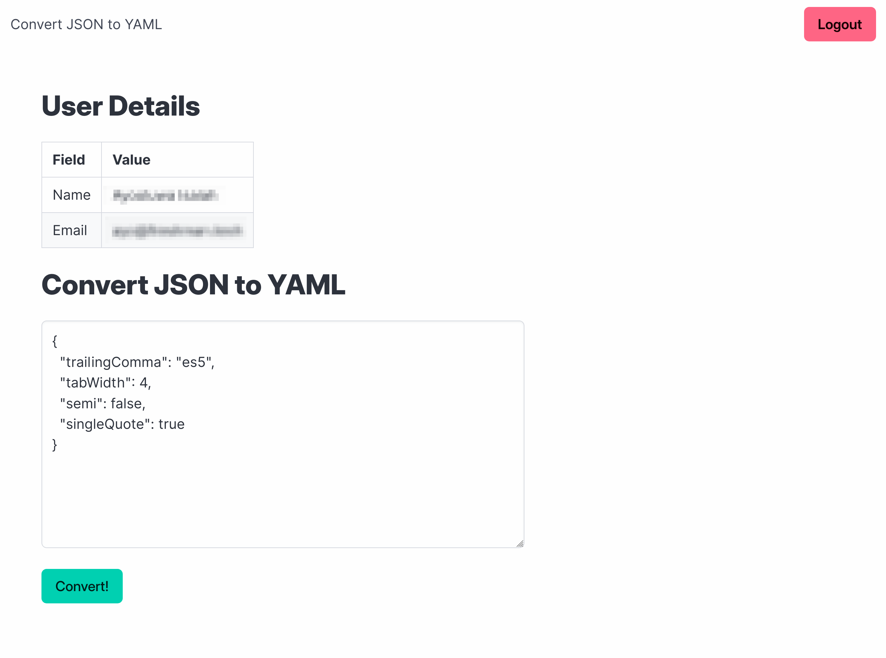

# Node.js JSON Converter

Learn how to instrument a distributed Node.js application to emit traces using OpenTelemetry.

**Tutorial**:
[Distributed Tracing in Node.js with OpenTelemetry (Beginner's Guide)](https://betterstack.com/community/guides/scaling-nodejs/opentelemetry-nodejs-tracing)

## ⚖ License

The code used in this project and in the linked tutorial are licensed under the
[Apache License, Version 2.0](LICENSE)
